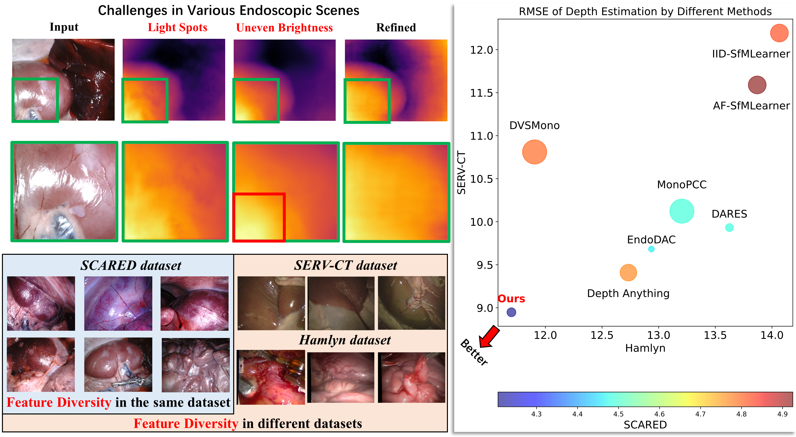

<p align="center">

</p>



Here is the pre-released implementation for "**G**eneralizable Self-supervised <ins>Mo</ins>nocular <ins>D</ins>epth <ins>E</ins>stimation with Block-wise Mixture of Low-Rank Experts for **D**iverse <ins>E</ins>ndoscopic Scenes". 

In this repository, **the evaluation code and instruction** have been released. <ins>The whole code will be published upon acceptance</ins>.

## Installation
**Information of Our Platform**: Ubuntu 22.04 + NVIDIA RTX 4090 *1 + CUDA 11.8

**Anaconda Enviroment**: `pip install -r requirements.txt`

## Data Preparation

- **SCARED**: Following [Challenge Rules](https://endovissub2019-scared.grand-challenge.org/) --- Train and Eval, Realistic
- **SERV-CT**: Download from [Here](https://www.ucl.ac.uk/interventional-surgical-sciences/weiss-open-research/weiss-open-data-server/serv-ct) (From [This Ref.](https://www.sciencedirect.com/science/article/pii/S1361841521003479)) --- Zero-shot Eval, Realistic
- **Hamlyn**: Download Rectified data from [Here](https://unizares-my.sharepoint.com/personal/recasens_unizar_es/_layouts/15/onedrive.aspx?id=%2Fpersonal%2Frecasens%5Funizar%5Fes%2FDocuments%2FDoctorado%2FEndo%2DDepth%2Dand%2DMotion%2FOpen%20access%20files%2Fhamlyn%5Fdata&ga=1) (From [This Ref.](https://ieeexplore.ieee.org/abstract/document/9478277)) --- Zero-shot Eval, Realistic
- **SimCol**: Download from [Here](https://rdr.ucl.ac.uk/articles/dataset/Simcol3D_-_3D_Reconstruction_during_Colonoscopy_Challenge_Dataset/24077763) (From [This Ref.](https://arxiv.org/abs/2307.11261)) --- Train and Eval, Simulated
- **C3VD**: Download Evaluation split from [Here](https://drive.google.com/drive/folders/1QfacGUjaD1-ByC1XvukUzu84HGdwKXhF) (From [This Ref.](https://link.springer.com/chapter/10.1007/978-3-031-73411-3_27)) --- Zero-shot Eval, Simulated
- **EndoMapper**: Download from [Here with request](https://www.synapse.org/#!Synapse:syn52137895) (From [This Ref.](https://www.nature.com/articles/s41597-023-02564-7)) --- Qualitative Sim-to-Real

_Sincerely thanks for the remarkable contribution from above datasets to the community!!!_

## Pretrained Weights
Trained on _SCARED dataset_ for **Realistic Datasets**:
|Methods|From|Abs Rel|Sq Rel|RMSE|RMSE Log|$\delta$|Pretrained Weight|
|:---|:---|:---:|:---:|:---:|:---:|:---:|:---:|
|AF-SfMLearner|**MedIA'22**|0.059|0.435|4.925|0.082|0.974|Download [Here](https://github.com/ShuweiShao/AF-SfMLearner/tree/main?tab=readme-ov-file#-model-zoo)|
|Depth Anything|**CVPR'24**|0.055|0.410|4.769|0.078|0.973|Download [Here]()|
|Depth Anything v2|**NeurIPS'24**|0.076|0.683|6.379|0.104|0.949|Download [Here]()|
|DARES|**ECCV'24**|0.052|0.356|4.483|0.073|0.980|Download [Here](https://github.com/mobarakol/DARES?tab=readme-ov-file#model-zoo)|
|IID-SfMLearner|**JBHI'24**|0.057|0.430|4.822|0.079|0.972|Download [Here]()|
|DVSMono|**BIBM'24**|0.055|0.410|4.797|0.078|0.975|Download [Here](https://github.com/adam99goat/DVSMono/tree/main/AF_training_split)|
|EndoDAC|**MICCAI'24**|0.052|0.362|4.464|0.072|0.979|Download [Here](https://github.com/BeileiCui/EndoDAC/tree/main?tab=readme-ov-file#results)|
|MonoPCC|**MedIA'25**|0.051|0.349|4.488|0.072|0.983|Download [Here](https://github.com/adam99goat/MonoPCC/tree/main/evaluation_results/AF_training_split)|
|**GD-EMoDE**|**Ours**|**0.047**|**0.307**|**4.206**|**0.067**|**0.985**|Download [Here]()|

Trained on _SimCol dataset_ for **Simulated Datasets**:
|Methods|From|Abs Rel|Sq Rel|RMSE|RMSE Log|$\delta$|Pretrained Weight|
|:---|:---|:---:|:---:|:---:|:---:|:---:|:---:|
|AF-SfMLearner|**MedIA'22**|0.086|0.080|0.426|0.109|0.950|Download [Here]()|
|IID-SfMLearner|**JBHI'24**|0.080|0.069|0.429|**0.108**|**0.959**|Download [Here]()|
|EndoDAC|**MICCAI'24**|0.107|0.110|0.530|0.133|0.924|Download [Here]()|
|**GD-EMoDE**|**Ours**|**0.078**|**0.056**|**0.421**|0.109|**0.959**|Download [Here]()|

## Evaluation of Depth Estimation
Firstly export ground truth of SCARED/SimCol dataset:
```
python export_gt_depth.py --data_path <data_path> --split endovis/simcol --usage eval
```
Then evaluate the depth estimation model on
- SCARED/Hamlyn dataset:
```
python evaluate_depth.py --data_path <data_path> --load_weights_folder <weights_path> --model_type <model_type> --peft_type <peft_type> --eval_split endovis/hamlyn --learn_intrinsics <True/False> --visualize_depth
```
- SERV-CT dataset:
```
python evaluate_depth.py --data_path <data_path> --load_weights_folder <weights_path> --model_type <model_type> --peft_type <peft_type> --eval_split servct --max_depth 200 --learn_intrinsics <True/False> --visualize_depth
```
- SimCol dataset:
```
python evaluate_depth.py --data_path <data_path> --load_weights_folder <weights_path> --model_type <model_type> --peft_type <peft_type> --eval_split simcol --weight 256 --max_depth 200 --learn_intrinsics <True/False> --visualize_depth
```
- C3VD dataset:
```
python evaluate_depth.py --data_path <data_path> --load_weights_folder <weights_path> --model_type <model_type> --peft_type <peft_type> --eval_split c3vd --weight 256 --max_depth 100 --learn_intrinsics <True/False> --visualize_depth
```
**The parse setting** for different methods are listed as the following table:
|**Models**|`--model_type`|`--peft_type`|`--learn_intrinsics`|
|:---:|:---:|:---:|:---:|
|**Ours**|`gdemode`|`bwmole`|`True`|
|EndoDAC|`endodac`|`part-dvlora`|`True`|
|Depth Anything(Finetuned)|`depthanything`|`none`|`True`|
|DARES|`dares`|`none`|`False`|
|MonoPCC|`pcc`|`none`|`False`|
|DVSMono|`pcc`|`none`|`False`|
|IID-SfMLearner|`afsfm`|`none`|`False`|
|AF-SfMLearner|`afsfm`|`none`|`False`|

